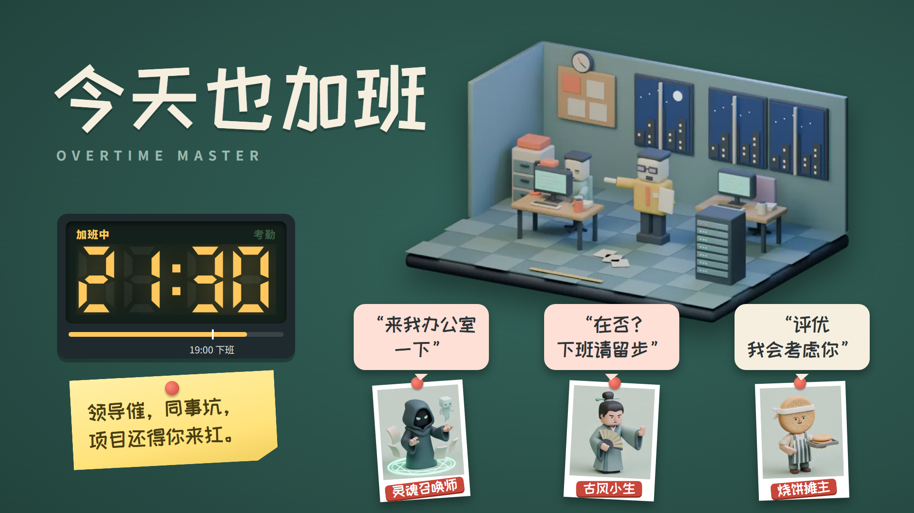

# 今天也加班 OvertimeMaster

竖屏办公室生存小游戏：领导催，同事坑，项目还得你来扛。三十天内交满 2600 点，还要想办法准点下班。

**在线试玩：** https://grrreymane.github.io/OvertimeMaster/

## 怎么玩

- 点**工作**做出草稿，右上角小标签切换时长
- 点**提交**把草稿交进项目，交了才算进度；**下班**时没交的草稿会丢
- 压力越高，产出效率越低，累了就**休息**
- 领导找你时会弹出一张内部便函，选一项应对；手上有**聊天记录**可以省时间、保草稿
- 19:00 起可以**下班**；本月加班超过 45 小时会被 HR 约谈，之后每天 18:00 必须走
- 第 30 天结束前交满 2600 点就赢

## 内容

- 18 位奇葩领导，每周一随机换 3 位同时生效，各有名言、持续效果和专属事件
- 16 种普通事件、每天不同的随机环境、白天到深夜的办公室光影
- 复盘编号：同一编号抽出同样的领导、天气和事件

进度保存在浏览器本地存储里。这里只放可玩的网页文件。

字体：Noto Sans SC 与站酷快乐体子集，SIL Open Font License，见 `fonts/`。
